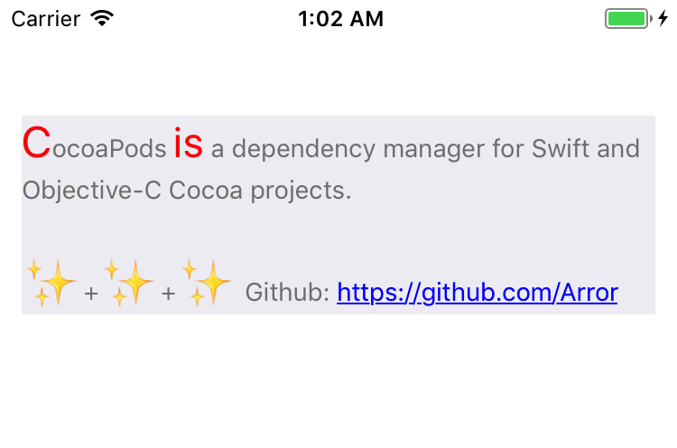

# AttributesBuilder
## Installation
    pod 'AttributesBuilder'

## Usage

```swift
let linkStr = "https://github.com/Arror"

let content = """
CocoaPods is a dependency manager for Swift and Objective-C Cocoa projects.

✨+✨+✨ Github: \(linkStr)
"""

let style = AttributesParagraphStyleBuilder { 
    $0.lineSpacing(12.0)
}
        
var whole = AttributesBuilder {     
    $0.color(.gray)
    $0.font(.systemFont(ofSize: 14.0))
}
        
style.merge(to: &whole)

let link = AttributesBuilder {
    $0.color(.blue)
    $0.link(URL(string: linkStr)!)
}

let first = whole.copy {
    $0.color(.red)
    $0.font(.systemFont(ofSize: 24.0))
}

let mark = AttributesBuilder {
    $0.font(.boldSystemFont(ofSize: 30.0))
}

let r1 = content.startIndex..<(content.index(after: content.startIndex))

let r2 = content.index(content.startIndex, offsetBy: 10)..<content.index(content.startIndex, offsetBy: 12)

self.contentLabel.attributedText = content
    .rs.rendered(by: whole)
    .rs.rendered(by: first, ranges: r1, r2)
    .rs.rendered(by: link, regexPattern: linkStr)
    .rs.rendered(by: mark, regexPattern: "✨")

```